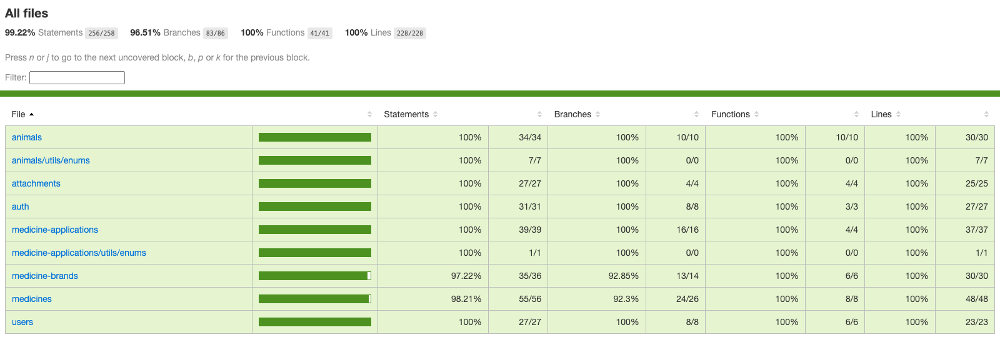

<h1 align="center" style="font-weight: bold;">Focinho Amigo 🐾</h1>

 <a href="#technologies">Tecnologias</a> • 
 <a href="#description">Descrição</a> • 
 <a href="#prerequisites">Pré-requisitos</a> • 
 <a href="#installation">Instalação</a>

<h2 id="technologies">💻 Tecnologias</h2>

           

<h2 id="description">📚 Descrição</h2>

O **Focinho Amigo** é um sistema de gerenciamento para a ONG **Focinho Amigo**, que atua na cidade de **Indaiatuba - SP**.

O objetivo é auxiliar no controle das informações relacionadas aos animais sob cuidados da ONG, oferecendo funcionalidades como:

- **Controle de anexos**
  - Associação de documentos/arquivos a cada animal
  - Armazenamento via **Cloudflare R2**

- **Gerenciamento de medicamentos**
  - Registro de medicamentos e aplicações realizadas
  - Agendamento de futuras aplicações
  - Integração com **Google Calendar** para criar/remover eventos
  - O próprio Google Calendar pode notificar o responsável quando estiver próximo do horário de aplicação

- **Métricas de animais por estágio**
  - Total de animais em **quarentena** (em tratamento)
  - Total de animais **acolhidos** (prontos para adoção)
  - Total de animais **adotados**

<h2>✅ Testes</h2>

A aplicação possui testes **unitários** e **E2E** para garantir que os fluxos principais estão funcionando corretamente.

Para rodar os testes unitários: `pnpm test`
Para rodar os testes E2E: `pnpm run test:e2e`
Para ver a cobertura de testes: `pnpm run test:coverage`

<h2 id="prerequisites">🧩 Pré-requisitos</h2>

- Node
- Npm
- Pnpm
- Docker

Se você ainda não tiver o pnpm instalado, rode: `npm install -g pnpm`

<h2 id="installation">⚙️ Instalação</h2>

1. Clone esse repositório: `git clone https://github.com/victorozoterio/friendly-snout-back.git`
2. Crie um arquivo `.env` a partir do arquivo `.env.example`
3. Preencha todas as variáveis necessárias no arquivo `.env`
4. Instale as dependências: `pnpm install`
5. Suba o contêiner Docker: `docker compose up -d`
6. Rode a aplicação: `pnpm run start:dev`

<h2>🔮 Melhorias futuras</h2>

- [ ] Adicionar logs estruturados utilizando Pino
- [ ] Observabilidade utilizando OpenTelemetry + Jaeger
